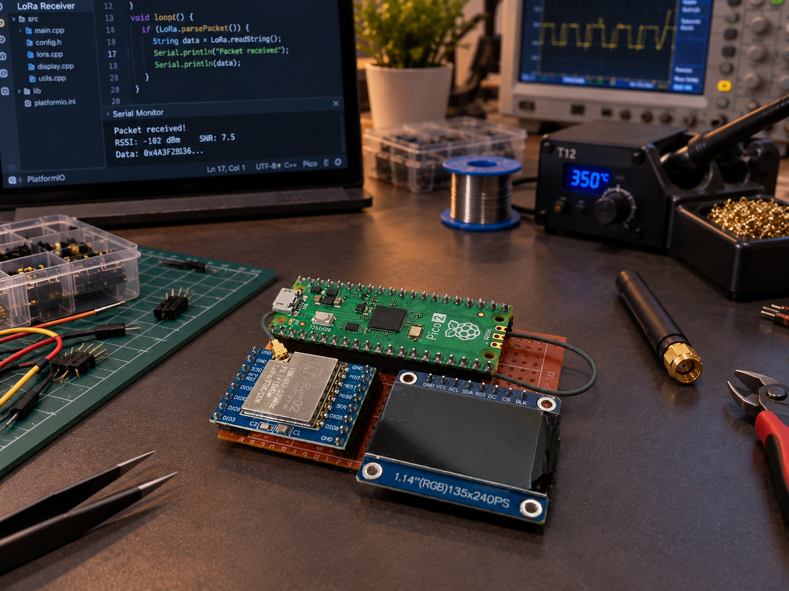

# LoRa Tracker

A custom Raspberry Pi Pico 2-based LoRa receiver board designed and built as the **base station receiver for the [WildLife AI project](https://github.com/Gavinduachintha/WildLife_AI)**.

The board receives real-time LoRa packets transmitted by the remote wildlife monitoring unit and provides the hardware interface required for the base station display and power system.

## Project Preview


## Overview

The LoRa Tracker is a custom PCB designed to serve as the receiver unit of the WildLife AI system.

It integrates a **Raspberry Pi Pico 2** with dedicated interfaces for the LoRa transceiver, display, and battery power. The board replaces the earlier breadboard-based receiver prototype with a compact and more reliable PCB-based design.

### Main functions

* Receives data from the remote WildLife AI monitoring device through LoRa
* Provides an interface between the LoRa transceiver and Raspberry Pi Pico 2
* Connects to a small color display for receiver-side information
* Provides battery-powered operation
* Includes an onboard power switch
* Provides dedicated headers for external module connections

## Hardware

### Main Controller

* **Raspberry Pi Pico 2**
* RP2350-based microcontroller
* Used as the main controller for the receiver
* Handles incoming LoRa packets and receiver-side processing

### LoRa Interface

The PCB provides dedicated headers for connecting the LoRa transceiver module.

Supported interface signals include:

* MOSI
* MISO
* SCK
* NSS / CS
* RST / RES
* VCC
* GND

### Display Interface

A dedicated 8-pin header is provided for connecting the receiver display.

The interface includes signals such as:

* SCL
* SDA
* BLK
* VCC
* GND

### Power

The board includes:

* 2-pin JST battery connector
* Onboard SPST power switch
* Dedicated power connections for the controller and connected modules

## PCB Design

The board was designed using **KiCad** with the Raspberry Pi Pico 2 positioned as the main controller module.

The PCB provides dedicated connection points for the LoRa module, display, and battery, allowing the receiver to be assembled without the wiring complexity of the original prototype.


## Repository Structure

```text
.
├── LoRa Tracker.kicad_pro   # KiCad project
├── LoRa Tracker.kicad_sch   # Schematic
├── LoRa Tracker.kicad_pcb   # PCB layout
└── Images/
    ├── Front Side.png
    └── LoRa Tracker.png
```

## Opening the Project

The project was designed using KiCad.

Open:

```text
LoRa Tracker.kicad_pro
```

from KiCad to access the schematic and PCB layout.

## WildLife AI Integration

This receiver is part of the **WildLife AI** system.

The overall system consists of a remote monitoring device and this receiver/base station.

```text
Remote Wildlife Monitor
        │
        │  LoRa
        ▼
┌─────────────────────┐
│   LoRa Tracker      │
│   Base Station      │
│                     │
│  Raspberry Pi Pico 2│
│  LoRa Interface     │
│  Display Interface  │
└─────────────────────┘
```

The remote unit collects information in the field and transmits it wirelessly through LoRa. The LoRa Tracker receives those packets and acts as the hardware foundation of the base station.

Learn more about the complete system:

[WildLife AI](https://github.com/Gavinduachintha/WildLife_AI)

## Development Workflow

Before manufacturing or modifying the board, the following checks should be performed:

* Review schematic connectivity
* Run KiCad ERC
* Run KiCad DRC
* Verify connector pinouts
* Verify component footprints and orientations
* Check the PCB edge cuts
* Generate fabrication files
* Assemble and test the hardware

## Current Status

The PCB has been designed and built as the **receiver/base station hardware for the WildLife AI project**.

The repository contains the KiCad source files required to inspect and continue development of the board.

## Future Hardware Improvements

Possible future revisions may include:

* Improved printed enclosure
* More integrated LoRa module mounting
* Additional status indicators
* Improved power management
* Further PCB size and connector optimization
* Improved connection distance
* Improved GUI with menu based navigation

## License

No license has currently been added to this repository.
If you intend to allow others to reuse or modify the design, a suitable open-source hardware license can be added.
